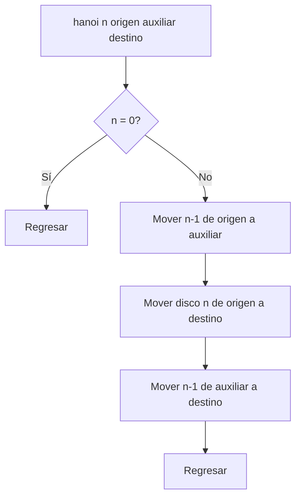

# Tower of Hanoi

**Autor:** CSES Problem Set

**Link:** [https://cses.fi/problemset/task/2165/](https://cses.fi/problemset/task/2165/)

## Descripción

Se tienen $n$ discos apilados en una varilla, ordenados de mayor a menor de abajo hacia arriba. Hay tres varillas: origen, auxiliar y destino. En cada movimiento se puede tomar el disco superior de una varilla y colocarlo en otra, pero nunca se puede colocar un disco grande encima de uno más pequeño.

Imprime una secuencia válida de movimientos que lleve todos los discos de la primera varilla a la tercera, usando la segunda como auxiliar.

## Entrada

Una línea con un entero $n$ ($1 \leq n \leq 16$), el número de discos.

## Salida

Primero imprime el número mínimo de movimientos. Luego imprime cada movimiento indicando las varillas origen y destino con los números 1, 2 y 3.

## Ejemplos

### Ejemplo de entrada

```text
2
```

### Ejemplo de salida

```text
3
1 2
1 3
2 3
```

## Temas identificados

### Programación

- Recursión múltiple.
- Divide y vencerás en una estructura de movimientos.
- Análisis de una recurrencia.

### Matemáticas

- Recurrencia $M(n)=2M(n-1)+1$.
- Suma geométrica y potencia de dos.

## Propuesta de solución

**Autor de la propuesta:** Kaarlarax

Para mover $n$ discos de la varilla origen a la destino, primero debemos liberar el disco más grande. Para hacerlo, movemos los $n-1$ discos superiores a la varilla auxiliar. Después movemos el disco más grande al destino y, finalmente, movemos los $n-1$ discos desde el auxiliar hasta el destino.

La misma estrategia resuelve las dos tareas de mover $n-1$ discos, por lo que la definición es recursiva.

## Observaciones

- Para mover un disco grande, todos los discos que tiene encima deben estar en la tercera varilla.
- La varilla que no es origen ni destino funciona como auxiliar en cada llamada.
- Para $n=0$ no se necesita ningún movimiento.
- El orden de los parámetros de las llamadas cambia según el rol de las varillas; dibujar tres varillas para los primeros pasos ayuda a evitar errores.

## Restricciones

La solución imprime $2^n-1$ movimientos. Para $n\leq16$, el máximo es $65535$, por lo que el número de líneas es manejable.

## Estados o estructura de la solución

La función `hanoi(n, origen, auxiliar, destino)` representa la tarea de imprimir los movimientos necesarios para trasladar los $n$ discos superiores desde `origen` hasta `destino`, utilizando `auxiliar`.

## Casos base

Si $n=0$, la tarea está terminada y la función regresa sin imprimir movimientos. En cualquier llamada con $n>0$, las llamadas siguientes reciben $n-1$, así que se alcanza el caso base.

## Transiciones o algoritmo

1. Mover recursivamente los $n-1$ discos superiores de origen a auxiliar, usando destino como auxiliar.
2. Imprimir el movimiento del disco $n$ de origen a destino.
3. Mover recursivamente los $n-1$ discos desde auxiliar a destino, usando origen como auxiliar.



## Correctitud

Se demuestra por inducción sobre $n$.

- **Base:** si $n=0$, no hay discos que mover y no se imprime ningún movimiento; la solución es correcta.
- **Paso inductivo:** supongamos que las llamadas para $n-1$ discos realizan correctamente el traslado entre las varillas indicadas. La primera llamada mueve los $n-1$ discos superiores a la varilla auxiliar. Así, el disco mayor queda libre y puede moverse al destino sin violar las reglas. La segunda llamada traslada los $n-1$ discos auxiliares al destino, encima del disco mayor. Por hipótesis inductiva, ambos traslados son válidos; por tanto, la secuencia completa también lo es.

## Complejidad computacional

El número de movimientos cumple $M(0)=0$ y $M(n)=2M(n-1)+1$, de donde $M(n)=2^n-1$.

- Tiempo: $O(2^n)$, que incluye la impresión de los movimientos.
- Memoria: $O(n)$.

## Implementación

### C++

**Autor de la implementación:** Kaarlarax

```cpp
#include <bits/stdc++.h>
using namespace std;

void hanoi(int n, int origen, int auxiliar, int destino) {
    if (n == 0) {
        return;
    }

    hanoi(n - 1, origen, destino, auxiliar);
    cout << origen << ' ' << destino << '\n';
    hanoi(n - 1, auxiliar, origen, destino);
}

int main() {
    ios::sync_with_stdio(false);
    cin.tie(nullptr);

    int n;
    cin >> n;

    cout << (1 << n) - 1 << '\n';
    hanoi(n, 1, 2, 3);
    return 0;
}
```

## Casos límite

- $n=1$: se imprime un movimiento, de la varilla 1 a la 3.
- $n=2$: se imprimen tres movimientos y el disco mayor se mueve en el segundo.
- $n=16$: se imprimen $65535$ movimientos; se debe conservar exactamente el formato solicitado.
